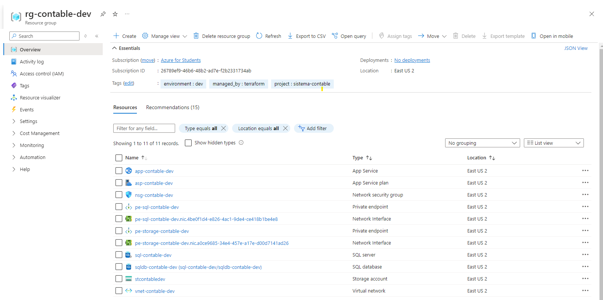

# Sistema Contable en Azure con Terraform

Este proyecto implementa la infraestructura para un sistema contable en Azure utilizando Terraform. La arquitectura está diseñada para ser segura, escalable y fácil de mantener.

## Estructura del proyecto

```
├── main.tf
├── network.tf
├── database.tf
├── security.tf
├── storage.tf
├── webapp.tf
├── variables.tf
└── README.md
```

El proyecto está organizado en varios archivos .tf, cada uno con un propósito específico:

- `main.tf`: Configuración del proveedor y grupo de recursos
- `network.tf`: Configuración de la red virtual y subnets
- `database.tf`: Configuración del servidor SQL y base de datos
- `security.tf`: Reglas de seguridad y NSG
- `storage.tf`: Configuración de la cuenta de almacenamiento
- `webapp.tf`: Configuración del App Service y Web App
- `variables.tf`: Definición de variables

## Componentes Principales

### 1. Proveedor y Grupo de Recursos (main.tf)

```Java
provider "azurerm" {
  features {}
  subscription_id = var.subscription_id # ID de suscripción de Azure
}

resource "azurerm_resource_group" "rg" {
  name     = "rg-${var.project}-${var.environment}"
  location = var.location
  tags     = var.tags
}
```

En este archivo, configuramos el proveedor de Azure y creamos el grupo de recursos base para nuestro proyecto.

### 2. Red Virtual y Subnets (network.tf)

#### Vnet


#### Subnets


Creamos una red virtual con tres subnets:
- Web: Para la capa de presentación
- App: Para la lógica de negocio
- Data: Para almacenar datos de forma segura

### 3. Base de Datos SQL (database.tf)

```Java
resource "azurerm_mssql_server" "sqlserver" {
  name                         = "sql-${var.project}-${var.environment}"
  resource_group_name          = azurerm_resource_group.rg.name
  location                     = azurerm_resource_group.rg.location
  version                      = "12.0"
  administrator_login          = var.sql_admin_login
  administrator_login_password = var.sql_admin_password

  tags = var.tags
}

resource "azurerm_mssql_database" "sqldb" {
  name           = "sqldb-${var.project}-${var.environment}"
  server_id      = azurerm_mssql_server.sqlserver.id
  collation      = "SQL_Latin1_General_CP1_CI_AS"
  license_type   = "LicenseIncluded"
  max_size_gb    = 2
  sku_name       = "S0"
  
  tags = var.tags
}

resource "azurerm_private_endpoint" "sql_pe" {
  name                = "pe-sql-${var.project}-${var.environment}"
  location            = azurerm_resource_group.rg.location
  resource_group_name = azurerm_resource_group.rg.name
  subnet_id           = azurerm_subnet.subnets["data"].id

  private_service_connection {
    name                           = "psc-sql-${var.project}-${var.environment}"
    private_connection_resource_id = azurerm_mssql_server.sqlserver.id
    is_manual_connection           = false
    subresource_names              = ["sqlServer"]
  }

  tags = var.tags
}
```

Configuramos un servidor SQL de Azure y una base de datos, utilizando un Private Endpoint para garantizar un acceso seguro.

### 4. Seguridad (security.tf)

```Java
resource "azurerm_network_security_rule" "allow_https" {
  name                        = "AllowHTTPS"
  priority                    = 100
  direction                   = "Inbound"
  access                      = "Allow"
  protocol                    = "Tcp"
  source_port_range           = "*"
  destination_port_range      = "443"
  source_address_prefix       = "*"
  destination_address_prefix  = "*"
  resource_group_name         = azurerm_resource_group.rg.name
  network_security_group_name = azurerm_network_security_group.nsg.name
}

resource "azurerm_network_security_rule" "allow_sql" {
  name                        = "AllowSQL"
  priority                    = 200
  direction                   = "Inbound"
  access                      = "Allow"
  protocol                    = "Tcp"
  source_port_range           = "*"
  destination_port_range      = "1433"
  source_address_prefix       = azurerm_subnet.subnets["app"].address_prefixes[0]
  destination_address_prefix  = "*"
  resource_group_name         = azurerm_resource_group.rg.name
  network_security_group_name = azurerm_network_security_group.nsg.name
}
```

Definimos reglas de seguridad en nuestro Network Security Group, incluyendo:
- Permitir tráfico HTTPS
- Permitir acceso SQL desde la subnet de aplicaciones

### 5. Almacenamiento (storage.tf)

```Java
resource "azurerm_storage_account" "storage" {
  name                     = "st${var.project}${var.environment}"
  resource_group_name      = azurerm_resource_group.rg.name
  location                 = azurerm_resource_group.rg.location
  account_tier             = "Standard"
  account_replication_type = "LRS"

  tags = var.tags
}

resource "azurerm_storage_container" "container" {
  name                  = "documents"
  storage_account_name  = azurerm_storage_account.storage.name
  container_access_type = "private"
}

resource "azurerm_private_endpoint" "storage_pe" {
  name                = "pe-storage-${var.project}-${var.environment}"
  location            = azurerm_resource_group.rg.location
  resource_group_name = azurerm_resource_group.rg.name
  subnet_id           = azurerm_subnet.subnets["data"].id

  private_service_connection {
    name                           = "psc-storage-${var.project}-${var.environment}"
    private_connection_resource_id = azurerm_storage_account.storage.id
    is_manual_connection           = false
    subresource_names              = ["blob"]
  }

  tags = var.tags
}
```

Creamos una cuenta de almacenamiento con un contenedor privado para documentos, implementando un Private Endpoint para acceso seguro.

### 6. Aplicación Web (webapp.tf)

```Java
resource "azurerm_service_plan" "plan" {
  name                = "asp-${var.project}-${var.environment}"
  location            = azurerm_resource_group.rg.location
  resource_group_name = azurerm_resource_group.rg.name
  os_type             = "Linux"
  sku_name            = var.app_service_sku

  tags = var.tags
}

resource "azurerm_linux_web_app" "webapp" {
  name                = "app-${var.project}-${var.environment}"
  location            = azurerm_resource_group.rg.location
  resource_group_name = azurerm_resource_group.rg.name
  service_plan_id     = azurerm_service_plan.plan.id

  site_config {
    application_stack {
      php_version = "8.0"  // Cambiar de lengaje si es necesario
    }
    always_on              = true
    vnet_route_all_enabled = true
  }

  tags = var.tags
}

resource "azurerm_app_service_virtual_network_swift_connection" "vnet_integration" {
  app_service_id = azurerm_linux_web_app.webapp.id
  subnet_id      = azurerm_subnet.subnets["web"].id
}
```

Configuramos un App Service Plan y una Web App PHP, integrándola con nuestra red virtual para una comunicación segura.

### 7. Variables (variables.tf)

```Java
variable "project" {
  description = "Project name"
  default     = "contable"
}

variable "environment" {
  description = "Environment (dev, staging, prod)"
  default     = "dev"
}

variable "location" {
  description = "Azure region"
  default     = "East US 2"
}

variable "tags" {
  description = "Tags to apply to resources"
  type        = map(string)
  default = {
    project     = "sistema-contable"
    environment = "dev"
    managed_by  = "terraform"
  }
}

variable "vnet_address_space" {
  description = "Address space for the VNet"
  default     = ["10.0.0.0/16"]
}

variable "subnet_prefixes" {
  description = "Address prefixes for subnets"
  type        = map(string)
  default = {
    web  = "10.0.1.0/24"
    app  = "10.0.2.0/24"
    data = "10.0.3.0/24"
  }
}

variable "app_service_sku" {
  description = "SKU for App Service Plan"
  default     = "S1"
}

variable "sql_admin_login" {
  description = "Admin username for SQL Server"
  default     = "sqladmin"
}

variable "sql_admin_password" {
  description = "Admin password for SQL Server"
  sensitive   = true
}

variable "subscription_id" {
    description = "ID de suscripción de Azure"
    type        = string
}
```

Definimos variables para hacer nuestro código más flexible y fácil de personalizar, incluyendo:
- Nombre del proyecto
- Entorno (dev, staging, prod)
- Región de Azure
- Configuraciones de red
- SKU del App Service

## Despliegue



Para desplegar esta infraestructura:

1. Clona este repositorio
2. Actualiza las variables en `variables.tf` según tus necesidades
3. Ejecuta:
   ```Shell
   terraform init
   terraform plan
   terraform apply
   ```

## Arquitectura Final


Este diagrama muestra cómo todos los componentes se conectan entre sí, proporcionando una visión general de la infraestructura desplegada.

## Seguridad

Este proyecto implementa varias medidas de seguridad:
- Uso de Private Endpoints para SQL y Storage
- Network Security Group con reglas específicas
- Segregación de redes mediante subnets

## Mantenimiento y Actualizaciones

Para realizar cambios en la infraestructura:
1. Modifica los archivos .tf relevantes
2. Ejecuta `terraform plan` para ver los cambios propuestos
3. Ejecuta `terraform apply` para aplicar los cambios